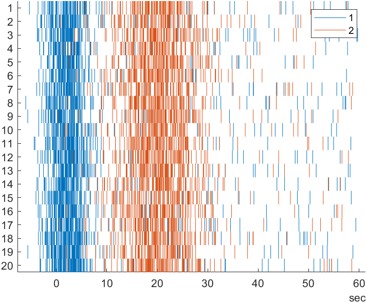

# Spike Raster Plot

[](https://www.mathworks.com/matlabcentral/fileexchange/101884-spike-raster-plot)

Version: 1.0

This chart creates a spike raster plot from spike time stamps with optional trial and group data.



## Syntax
* `spikeRasterPlot(spikeTimes)` create a spike raster plot with the specified spike timestamps. spikeTimes must be a vector of duration values.
* `spikeRasterPlot(spikeTimes, trials)` create a spike raster plot with the specified trial assignment for each spike time. trials must be a vector of equal length to the spike times and of type categorical or be convertible to categorical.
* `spikeRasterPlot()` create a spike raster plot using only name-value pairs.
* `spikeRasterPlot(___,Name,Value)` specifies additional options for the spike raster plot using one or more name-value pair arguments. Specify the options after all other input arguments.
* `spikeRasterPlot(parent,___)` creates the spike raster plot in the specified parent.
* `h = spikeRasterPlot(___)` returns the spikeRasterPlot object. Use h to modify properties of the plot after creating it.

## Name-Value Pair Arguments/Properties
* `SpikeTimeData` (n x 1 duration vector) spike time data.
* `TrialData` (n x 1 categorical vector) trial assignment of each spike in the SpikeTimeData.
* `GroupData` (n x 1 categorical vector) group assignment of each spike in the SpikeTimeData. 
* `AlignmentTimes` (n x 1 duration vector) time to use as alignment time for each trial.
* `ColorOrder` (m x 3 matrix of RGB triplets) list of colors to use for each group.
* `XLimits` (1 x 2 duration vector) x-limits of the plot.
* `XLimitsMode` (`'auto'` or '`manual'`) mode for the x-limits.
* `TitleText` (n x 1 string vector) title of the plot.
* `SubtitleText` (n x 1 string vector) subtitle of the plot.
* `XLabelText` (n x 1 string vector) x-label of the plot.
* `YLabelText` (n x 1 string vector) y-label of the plot.
* `LegendVisible` (scalar `matlab.lang.OnOffSwitchState`) display the legend or not.
* `LegendTitle` (n x 1 string vector) title on the legend.

## Example
Create a spike raster plot using  generated by the helper script `createExampleData`.
```
[spiketimes, trials, groups, trialStarts] = createExampleData;
s = spikeRasterPlot(spiketimes, trials, 'GroupData', groups);
s.AlignmentTimes = trialStarts;
s.LegendTitle = 'neuron';
ylabel('Lap')
```
